  <picture>
    <source media="(prefers-color-scheme: dark)" srcset="assets/banner/dark.svg" />
    <source media="(prefers-color-scheme: light)" srcset="assets/banner/light.svg" />
    
  </picture>

<h1 align="center">Parth Suryawanshi</h1>

  Software Developer | Tech Enthusiast | MCA Student at MIT World Peace University

## About Me

- Completed B.Sc in Computer Science from Dr. D. Y. Patil Arts, Commerce and Science College, Pimpri (SPPU University).
- Pursuing MCA at MIT World Peace University.
- Interested in software development, web technologies, and IoT systems.
- Building practical projects with clean UI, strong logic, and real-world impact.

## Current Projects

- ERP System for College: web-based administration and academics management platform.
- OneShot: disposable-style online camera platform to upload, manage, and share event photos securely.
- IoT Research Project: Automated Waste Garbage Separation using Arduino and Sensors (published in IJRAR, 2025).

## Learning Focus

- Data Science and Machine Learning
- React.js, Vue.js, and GSAP for dynamic interfaces
- MySQL and MongoDB for database design
- Cloud technologies and API integrations

## Tech Stack

- Languages: JavaScript, PHP, Python, C, C++, SQL
- Web: HTML5, CSS3, React.js, Vue.js, GSAP, Node.js
- Databases: MySQL, MongoDB
- Tools: Git, GitHub, VS Code, Postman, Figma, Linux

## Connect

- Email: [parthsur001@proton.me](mailto:parthsur001@proton.me)
- LinkedIn: [Parth Suryawanshi](https://www.linkedin.com/in/parth-suryawanshi)
- Portfolio: Coming soon

  "Talk is cheap. Show me the code." - Linus Torvalds

